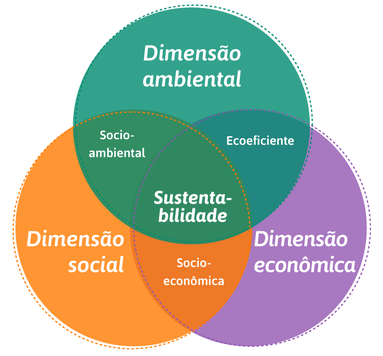

<!DOCTYPE html>
<html lang="en">
<head>
    <meta charset="UTF-8">
        <title>MEIO AMBIENTE E SUSTENTABILIDADE</title>
        <body>
            <h1>MEIO AMBIENTE</h1>
            <h2>Preservar é um ato de amor</h2>
            
Preservar o meio ambiente é um ato importante não só para a humanidade, mas para todos os seres que habitam a terra.
                Afinal, é nela que estão os recursos naturais necessários para a nossa sobrevivência: água, alimentos e matérias-primas. Sem esses recursos,todas as formas de vida do planeta poderão acabar.
                

                
                
A constituição brasileira de 1988 traz em seu artigo 225 que:
                    "Todos têm direito ao meio ambiente ecologicamente equilibrado, bem de uso comum do povo e essencial à sadia qualidade de vida, impondo-se ao poder público e à coletividade o dever de defendê-lo e preservá- lo para as presentes e futuras gerações.”
                    

                    
Assim, é papel não apenas do poder público, mas de toda a população trabalhar em prol do bem comum por meio da preservação do meio ambiente e isso se faz desde pequenas ações, como descartar o lixo em local adequado e a preservação dos recursos naturais.
                    

                <h3>SUSTENTABILIDADE</h3>
                <h4>O QUE É SUSTENTABILIDADE PARA VOCÊ?</h4>
                
                  
A capacidade de o ser humano interagir com o mundo, preservando o meio ambiente para não comprometer os recursos naturais das gerações futuras. O conceito de sustentabilidade é complexo, pois atende a um conjunto de variáveis interdependentes, mas podemos dizer que deve ter a capacidade de integrar as questões sociais, energéticas, econômicas e ambientais.
                

        </body>

    </head>
</html>
© 2021 GitHub, Inc.
Terms
Privacy
Security
Status
Docs

